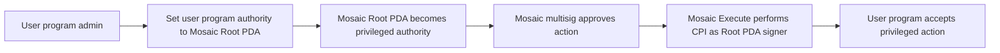
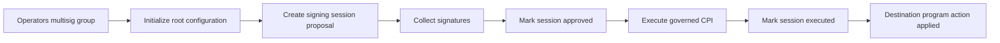
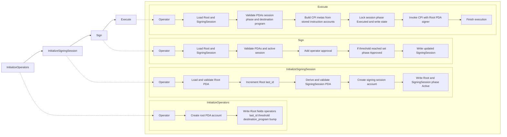
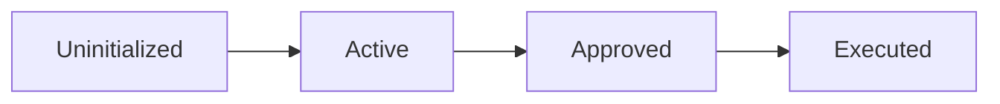

# Mosaic Program Flow

Mosaic is basically a multisig control layer:
- a `Root` PDA stores governance configuration,
- `SigningSession` PDAs store proposals and approvals,
- once threshold is hit, Mosaic executes via CPI to your destination pgoram.

## Authority delegation model

This is the authority handoff.
External program points its privileged authority to Mosaic `Root` PDA.
After that, no single key can do admin stuff solo; multisig rules gate it.

## Use case overview

Typical lifecycle:
one-time setup, then loop proposal -> sign -> execute for each governed action.

## Core instruction flows (side by side)

Same flows as 2.2-2.5, just packed side by side.

## Signing session lifecycle

Signing session lifecycle is linear.
Proposal moves forward only: create -> approve -> execute.

## PDA formulas

These PDA formulas are the address truth source.

The `Root PDA` comes from the static `root_pda` seed plus its bump.
The `SigningSession PDA` comes from the root address, the session id, the `signing_session_pda` seed, and its bump.

What matters most is the binding: the root address is part of the signing session derivation.
So a signing session created for one root is automatically invalid for any other root.